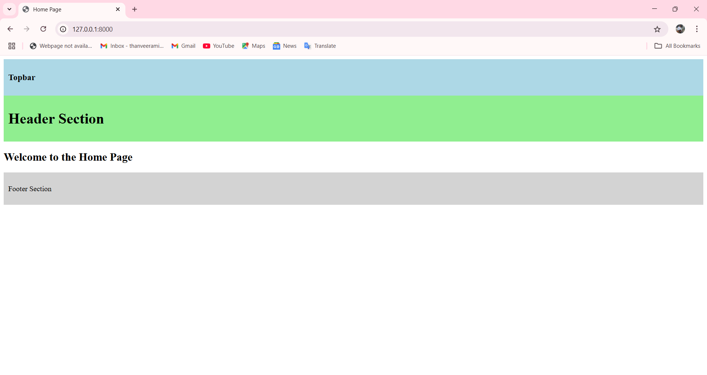

# Django Template Layout Project
Simple Django project to understand template layout with base templates and includes.

## 📸 Screenshot

Folder Structure:
frontend/
 └── templates/
      └── frontend/
           ├── layout/
           │    ├── app.html
           │    ├── topbar.html
           │    ├── header.html
           │    └── footer.html
           └── home.html

How it Works:
- home.html extends layout/app.html
- app.html includes topbar.html, header.html, footer.html
-  for page title
-  for page-specific content

Django Settings Setup:
INSTALLED_APPS = [
    'frontend',
    ...
]

TEMPLATES = [
    {
        'DIRS': [BASE_DIR / "frontend" / "templates"],
        ...
    },
]

URL and View Setup:
# frontend/views.py
# View function to render the home page template
def home(request):
    return render(request, "frontend/home.html")

# config/urls.py
from django.urls import path
from frontend import views

urlpatterns = [
    path('', views.home, name='home'),
]

How to Add New Pages:
- Create a new HTML file like about.html
- Extend layout/app.html
- Add your custom content inside 

Example:

About

<h2>About Page</h2>


Purpose:
- Understand Django template inheritance
- Learn clean project structure
- Easy to expand for bigger projects
